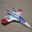
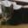
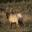
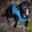
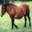
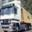

# CIFAR-10 Classification with Fine-Tuned CNNs and ML Models

## 📌 Project Overview
This project explores **transfer learning** on the CIFAR-10 dataset using **VGG19** and **ResNet50** with custom classification heads.  
After fine-tuning, the CNN feature extractors were used to train different ML models (Logistic Regression, SVM, Random Forest, etc.) on the extracted embeddings.  

---

## 📊 Dataset: CIFAR-10
- **Images:** 60,000 (50,000 train, 10,000 test)  
- **Image size:** 32×32×3 (RGB)  
- **Classes (10):**  
  - airplane ✈️  
  - automobile 🚗  
  - bird 🐦  
  - cat 🐱  
  - deer 🦌  
  - dog 🐶  
  - frog 🐸  
  - horse 🐎  
  - ship 🚢  
  - truck 🚚  

### 🔹 Example Images (one per class)
| airplane | automobile | bird | cat | deer | dog | frog | horse | ship | truck |
|----------|------------|------|-----|------|-----|------|-------|------|-------|
|  |  |  |  |  |  |  |  |  |  |

---

## 🏗️ Experiments

### 1. Fine-Tuned CNNs  
| Model         | Accuracy |
|---------------|----------|
| VGG19 + Head  | 82.94 %  |
| ResNet50 + Head | 96.01 %  |

### 2. Extracted Features + ML Models  
(Using features from GAP layer of fine-tuned CNNs)  

| Base Features | ML Model         | Accuracy |
|---------------|------------------|----------|
| VGG19         | Logistic Regression | XX.XX % |
| VGG19         | Random Forest       | 84.51 % |
| VGG19         | SVM (RBF Kernel)    | 84.77 % |
| VGG19         | KNN (k = 5)         | 83.74 % |
| VGG19         | XGBoost             | 84.50 % |

---

## 🚀 Key Insights
- Fine-tuned CNNs performed best overall.  
- ML models on extracted embeddings gave competitive results with much lower training cost.  
- Transfer learning significantly improved performance compared to training from scratch.  
